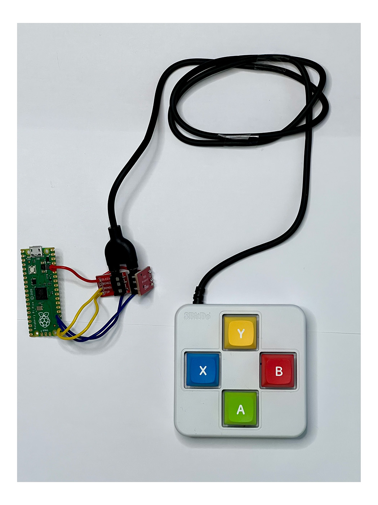
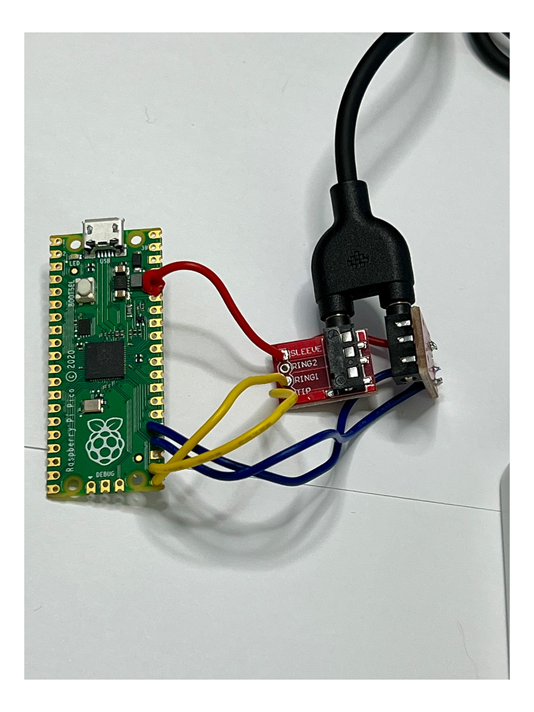
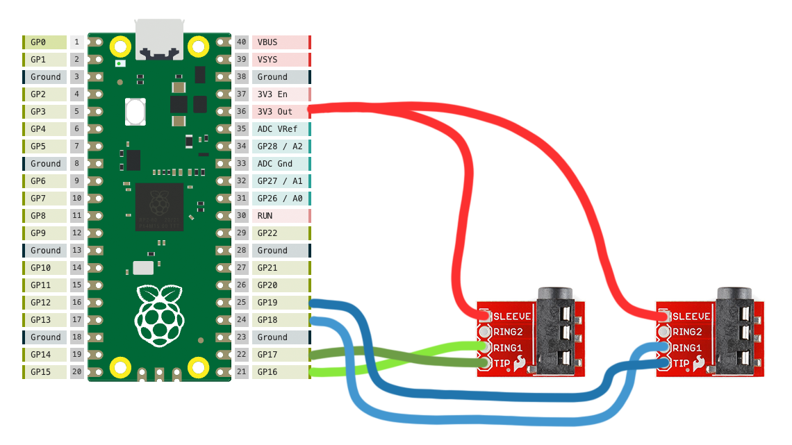

# 8BitDo-keyboard
Pi Pico-based solution for running 8BitDo keyboard extensions directly to USB

## What you need

* An 8BitDo Keyboard Extension. One (or multiple) of these:
    * https://shop.8bitdo.com/products/8bitdo-keyboard-extensions
* A Raspberry Pi Pico board
    * https://www.raspberrypi.com/products/raspberry-pi-pico/
    * You can use the most basic version. Wifi not required.
* A pair of TRS (audio jack) breakout boards
    * like this one: https://core-electronics.com.au/trrs-3-5mm-jack-breakout.html
    * Can be any brand
    * I'm using two, since my [chosen 8BD Extension](https://shop.8BitDo.com/products/8BitDo-keyboard-extensions?variant=44141790068913) needs two jacks
* Hook up wire
* Some light soldering

## Overview



A very quick and dirty wiring of the audio jacks to the Pi Pico.
<br/>




A close-up of the ABXY split-plug, connected with two audio jacks.

## Build

* Schematic



## Software Set Up

* Install Circuit Python on to your Pico
    * https://learn.adafruit.com/getting-started-with-raspberry-pi-pico-circuitpython/circuitpython

* Install the Adafruit Circuit Python libraries
    * Download from https://circuitpython.org/libraries
    * Open your CIRCUITPY drive
    * Copy the following libraries (listed below) into your `CIRCUITPY/lib/` folder
        * adafruit_hid (the whole folder)
        * adafruit_debouncer.mpy
        * adafruit_ticks.mpy

* Copy code.py (from this repository) into the root `CIRCUITPY/` folder
* (maybe) You might need to unplug and reconnect the Pico to your computer for changes to be seen
* Open VS Code (or Notepad) and test your buttons

## Customise

* Open the code.py file in VS Code or Notepad, and find the following lines in the file
* Amend the codes to customise your keys
```
17: # Set your keys here
18: btn_A_key = Keycode.Q
19: btn_B_key = Keycode.W
20: btn_X_key = Keycode.E
21: btn_Y_key = Keycode.R
```

